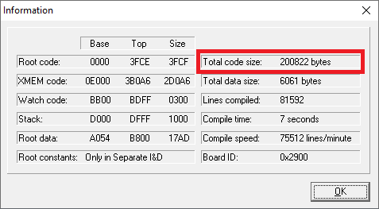
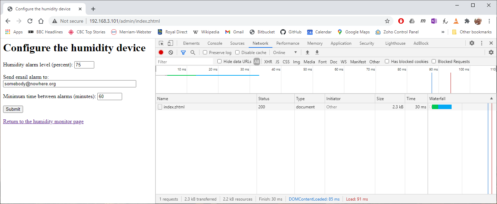
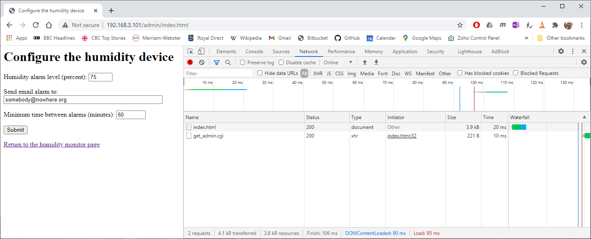

# Using JSON for Rabbit Web User Interface #
## Summary ##
This document describes a data formatting library for Rabbit and its use to create portable and efficient Web user interfaces.

## Introduction ##
One of the advantages of the Rabbit ecosystem is the included HTTP server that allows the construction of a user interface without having to connect any display, keyboard, buttons and LEDs. Web based user interfaces are much cheaper in production but I’ve always struggled with the time and effort required to build them. Looking at the Rabbit libraries one can see that Z-World (and latter Digi) had the same kind of struggle. The biggest problem is how to provide access to the program variables from the user interface layer and conversely, how to pass the user information back to the program.

A first method that appeared was to use “server-side includes” (SSI) variables to send the data to the user interface and some kind of form parsing to retrieve the user information. The method was clunky and required the HTTP server code to parse the pages that contained dynamic information every time it was serving them (see function `shtml_parse` in HTTP library).

Realizing these limitations, Z-World came up with the “Rabbit Web” extensions, initially as a paid add-on before being included in the standard Dynamic C offering. This was an over-the-top solution with language extensions, a scripting language and tons of code as if memory and time constraints on such a small processor did not exist.

What they failed to notice was that, in most cases, the client for the HTTP server was a computer or some other device with tons of processing power and that all the browsers out there already have a very powerful and fast scripting language, JavaScript, for which there are thousands of add-on libraries that can be leveraged to create great user interfaces. 

Hence my solution:
- Retrieve data from program using JSON formatting
- Port as much as possible of user interface logic in JavaScript code. In particular:
- Do all data validation on client side
- Send validated data back to the program where a simple parser can process it.

In addition, I used a set of simple conventions to make the program both easy to write and easy to understand.

## A walk through a sample program (SAMPLE_JSON.C) ##
This walk is not linear but hopefully it should not be too hard to follow.

### Populating the WEB page with server data ###
There is a sample page (PAGE1.HTML) containing a form with data from the Rabbit program. The user modified values are sent back when the "Submit" button is pressed. 

The `init` function is called when the page loads. It uses standard AJAX to request data from server.

*Convention:* the name of the CGI procedure for requesting current data values for a page is `get<page name>.cgi`.

The `nodata` variable contains a sample string with what the page expects from the server. This is useful both for designing the page layout and, later on, to create the server output string. The data coming from the server (or the `nodata` variable) is parsed from JSON format into the `servdata` variable.

The `set_fields` function takes care of populating all the page fields with data from the `servdata` variable. It can also do things like formatting the values. Such an example is the conversion from an unsigned long value to a dotted string IP address. Other useful things to do would be formatting floating-point values, highlighting out-of-range data, etc.

### JSONIFY – How data gets from server to Web page ###
When the AJAX component requests the answer from `getpage1.cgi`, the server invokes the function `cgi_getpage1` (again function names are given with an easy to follow pattern). 

```C
int cgi_getpage1 (HttpState *state)
{
  //send header and init output buffer
  json_begin (state);

  //format all variables that need to be sent back
  jsonify (state, &myip);
  jsonify (state, &ival1);
  jsonify (state, &ival2);
  jsonify (state, &fval);
  jsonify (state, &str);
  jsonify (state, &cbox);

  //finish buffer and send it back to user
  json_end (state);
  return 1;
}
```
The first function `json_begin` initializes the output buffer with the reply headers. Each of the following calls to `jsonify` function appends a JSON-formatted variable to the output buffer. Note how we can use the `nodata` variable from the web page to guide us what information we need to output. Finally the `json_end` function finishes the output buffer and sends it back to the Web page.

### JSON Data Dictionary ###
The magic done by `jsonify` function needs a little bit of support from a data structure called *data dictionary*. This is an array where each entry describes a variable that can be formatted and sent out. Here is the structure of such an entry:
```C
//JSON data dictionary entry
typedef struct jsonvar_t {
  char *name;           //external name of variable
  void *addr;           //memory address
  char type;            //data type (one of JT_... values)
  char sz;              //element size (used only for strings)
  char cnt;             //number of elements
} JSONVAR;

// JSON variable types
#define JT_INT    0
#define JT_UINT   1
#define JT_LONG   2
#define JT_ULONG  3
#define JT_FLT    4
#define JT_PSTR   5
#define JT_STR    6
```
It simply contains the JSON name of the variable, its memory address, the type of data (integer, long, string, float, etc.), the size of each element and the number of elements if this is an array.

A few macro definitions add some syntactic sugar, making easier to create the data dictionary:
```
JSD_START
  JSD (myip,    JT_ULONG, 1, 0),
  JSD (ival1,   JT_INT,   1, 0),
  JSD (ival2,   JT_INT,   1, 0),
  JSD (fval,    JT_FLT,   1, 0),
  JSD (cbox,    JT_INT,   1, 0),
  JSD (iarr,    JT_INT,   COUNTOF(iarr), 0),
  JSD (farr,    JT_FLT,   COUNTOF(farr), 0),
  JSD (str,     JT_STR,   1,             sizeof(str)),
  JSD (sarr,    JT_STR,   COUNTOF(sarr), sizeof(sarr[0])),
  JSD (varr,    JT_PSTR,  COUNTOF(varr), 0), 
  JSD (iarr_a,  JT_STR,   1,             sizeof(iarr_a)),
JSD_END;
```
Each `JSD` macro creates an entry in the data dictionary. The macro arguments are the variable name, the data type, number of elements and the size of each element. The size argument is used only for character strings. This JSD macro sets the JSON variable name to be the same as the program variable name. There is also a macro, `JSDN`, which allows you to set JSON name that is different from the variable name.

Arrays of strings can be declared in different ways. One is to declare them as a bi-dimensional array where each element has a fixed size:
```C
char sarr[5][80];
```
Another is to use an array of pointers to strings like in the following example:
```C
const char *varr[] = {"A few strings", "scattered in flash", "shown on WEB page"};
```
Arrays organized in the first way have to be declared using the type `JT_STR` while the second one is declared using the `JT_PSTR` type.

### Retrieving data from WEB form ###
When user presses the submit button of a form, the browser first invokes the `onsubmit` action. This in turn calls the `vaildate_form1` function. In general the validation function should check all values to see if they are within limits. Sometimes, to do the validation, you need other values that are inside the program but do not appear in the web page. You can just include those values in the data sent by the server to the web page.

If user data passes the validation criteria, the `validate_form1` function returns true and data is posted to `postform1.cgi`.

*Convention:* the name of the CGI procedure for setting new values for a form is `post<form name>.cgi`.

On the server side, that invokes the `cgi_postform1` function:
```C
int cgi_postform1 (HttpState *state)
{
  int len;

  //parse POST data
  if ((len=url_post (state)) <= 0)
  {
    if (len = -4)
      return cgi_continue (state, "page1.html"); //not a POST request
    else
      return len;
  }

  //other stuff that needs to be done with received data
  printf ("Web data updated\n ival1=%d\n", ival1);

  //where to go next
  cgi_redirectto (state, "page1.html");
  return 0;
}
```
The `url_post` function that takes care of parsing the URL encoded data and updating all the variables. At this stage the JSON data dictionary is used again to identify what variables have to be updated. After this stage the handler function can do whatever needs to be done with the received data and redirect the browser to whatever URL is appropriate. In this case we just reload the current page with the updated values. 

### The trouble with arrays ###
The URL encoding system has no concept of arrays so we have to come up with a convention for encoding array elements. By convention, the name of an array element is “`rray_<index>`. For instance (looking at `page2.html`) the elements of `iarr` array are “iarr_0”, “iarr_1”, and so on. The `url_post` function parses these keys in the URL encoded post and updates the appropriate variables. If the variable name contains underscores but doesn’t conform to the `array_<index>` pattern, it is processed like any regular variable (i.e. the whole name is searched in the JSON data dictionary).

Adding arrays to the parser brought a few extra wrinkles. Buffer overflow errors are so common that I felt the best place to handle them was in the parser itself instead of leaving the burden to the user. Hence parser checks the received array indices and ignores values above the specified array limits. Also for strings it checks the size of each element and truncates it to the declared size.

## Reworking a standard sample ##
For our next example, let's take the `HUMIDITY.C` sample (from `samples\tcpip\rabbitweb`) and convert it to use our JSON library. The resulting file, `humidity_json.c` can be found in `samples\tcpip\json`.

The application has two pages, `humidity_monitor.html` and `humidity_admin.html`. The first one is only retrieving data from the server, while the second one is also sending data back in response to form submission.

### Loading Data to Web Pages ###
The JavaScript code for retrieving data from server is fairly standard. Below is the code from the `humidity_admin.html` page:
```JS
  var xhr = new XMLHttpRequest;
  var servdata;
  var nodata=  '{"hum_alarm": 60,"alarm_email": "bob@example.com", "alarm_interval": 60}';

  function init ()
  {
    xhr.onreadystatechange = function ()
    {
      if (xhr.readyState == 4)
      {
        if (xhr.status == 200)
          servdata = JSON.parse(xhr.responseText);
        else
          servdata = JSON.parse(nodata);
        set_fields();
      }
    }
    xhr.open("GET", "/getadmin.cgi", true);
    xhr.timeout = 2000;
    try {
      xhr.send();
    } catch (err) {
      servdata = JSON.parse(nodata);
      set_fields ();      
    }    
  }
```
The `XMLHttpRequest` object sends a GET request to `/getadmin.cgi` and expects a JSON formatted reply. It parses the reply in the `servdata` variable and invokes the `set_fields()` function transfer the data to the page. If something goes wrong, it parses the `nodata` string instead of the server reply. This could happen when the server is not accessible.

The `set_fileds()` function simply populates the page with the received values:
```JS
  function set_fields()
  {
    document.getElementById("hum_alarm").value = servdata["hum_alarm"];
    document.getElementById("alarm_email").value = servdata["alarm_email"];
    document.getElementById("alarm_interval").value = servdata["alarm_interval"];    
  }
```
On the server side, the `cgi_getadmin()` function simply retrieves the required data and formats it as a JSON string:
```C
int cgi_getadmin (HttpState *state)
{
  json_begin (state);
  jsonify (state, &hum_alarm);
  jsonify (state, &alarm_email);
  jsonify (state, &alarm_interval);
  json_end (state);
  return 1;
}
```

### Posting Data Back to Server ###
When form submit button is pressed it invokes the `onsubmit` event handler. In turn, this one calls the `validate()` function:
```JS
  function validate ()
  {
    var err = false;
    
    // validate alarm value
    val = document.getElementById("hum_alarm").value;
    if (val < 0 || val > 100)
    {
      document.getElementById("hum_entry").style.color = "red";
      err = true;
    }
    else
      document.getElementById("hum_entry").style.color = "initial";
      
    // validate alarm interval
    val = document.getElementById("alarm_interval").value;
    if (val <0 || val >300000)
    {
      document.getElementById("interval_entry").style.color = "red";
      err = true;    
    }
    else
      document.getElementById("interval_entry").style.color = "initial";

    //validate email address
    email_pattern = /^[a-zA-Z0-9.!#$%&'*+\/=?^_`{|}~-]+@[a-zA-Z0-9-]+(?:\.[a-zA-Z0-9-]+)*$/;
    if (!document.getElementById ("alarm_email").value.match(email_pattern))
    {
      document.getElementById("email_entry").style.color = "red";
      err = true;        
    }
    else
      document.getElementById("email_entry").style.color = "initial";
    
    
    if (err)
    {
      document.getElementById("err_message").style.color = "red";
      document.getElementById("err_message").innerHTML = "ERROR!  Your submission contained errors.  Please correct the entries marked in red below.";
    }
    else
      document.getElementById("err_message").innerHTML = "";
    return !err;
  }
```
If you compare the validations performed by this function with the RabbitWeb version, you will notice that the RabbitWeb version does not validate the email address. Regular expressions are way above what the zscript
engine can do. Note also that all the validations are done on the client side without any load placed on the
server.

If the data has been validated, it is sent to the `/admin/setadmin.cgi` CGI function. On the server side this invokes the `cgi_setadmin()` function:
```C
int cgi_setadmin (HttpState *state)
{
  url_post (state);
  cgi_redirectto (state, "/admin/index.html");
  printf ("New alarm level is %d\nSending emails to: %s\n",
    hum_alarm, alarm_email);
  return 0;
}
```
Received data is parsed from the URL-encoded format and placed in the corresponding variables. The HHTP server is redirected to reload the Web page.

### Memory Usage and Execution Time ###
On a RCM4200 module, the RabbitWeb sample uses about 200k of memory:


The JSON version uses almost 136k. That is a cool 64k of space saved:


Time-wise, the RabbitWeb page loads in 30ms:

which is the same as the JSON version: 



## Reference ##
### `json_begin` ###
Sends reply headers and initializes output pointer to start of buffer.

Syntax:
```C
void json_begin (HttpState *state)
```
Parameters:
- `state`	pointer to HTTP state information

### `jsonify` ###
Serializes a variable to JSON format. The serialized string is appended to HTTP buffer.

Syntax:
```C
int jsonify (HttpState *state, void *addr)
```
Parameters:
- `state`	pointer to HTTP state information
- `addr`	pointer to variable that has to be serialized

Return:
- 0	    if successful
- -1    variable not found in JSON data dictionary

### `json_end` ###
Sends out the HTTP buffer that contains JSON formatted data.

Syntax:
```C
void json_end (HttpState *state)
```
Parameters:
- `state`	pointer to HTTP state information

### `readpost` ###
Read POST data in HTTP state buffer. Data is read up to length specified by `content-length` header.

Syntax:
```C
int readpost (HttpState *state)
```
Parameters:
- `state`	pointer to HTTP state information

Return:
- -1	content-length is greater than the total socket receive buffer size (HTTP_MAXBUFFER)
- -2	the socket is closed or closing, but insufficient data is in the buffer to satisfy the request
- -3	content-length <= 0 or invalid socket
- -4	HTTP request is not a POST request
- 0	    insufficient data is in the buffer to satisfy the request. Try again later since the socket is still able to receive data from the peer
- >0	content-length

### `url_post` ###
Read and parse an URL-encoded post response. Keywords in the POST response are parsed in variables based on JSON data dictionary.

Syntax:
```C
int url_post (HttpState *state)
```
Parameters:
- `state`	pointer to HTTP state information

Return:
- -1	content-length is greater than the total socket receive buffer size (HTTP_MAXBUFFER)
- -2	the socket is closed or closing, but insufficient data is in the buffer to satisfy the request
- -3	content-length <= 0 or invalid socket
- -4	HTTP request is not a POST request
- 0	    insufficient data is in the buffer to satisfy the request. Try again later since the socket is still able to receive data from the peer
- >0	number of fields parsed

### `JSD_START` ###
This macro definition must be placed at the beginning of the JSON data dictionary.

Syntax:
```
JSD_START
```

### `JSD_END` ###
This macro definition must be placed at the end of of the JSON data dictionary.

Syntax:
```
JSD_END;
```

### `JSD` ###
This macro definition creates an entry in the JSON data dictionary. The JSON name assigned to this variable is the same as the variable name.

Syntax:
```C
JSD (var, type, count, size),
```
Parameters:
- `var`	    the variable that has to be added to data dictionary
- `type`    type of each variable element. Can be one of:
    - `JT_INT` 	    short (2 bytes) integer
    - `JT_UINT`	    short (2 bytes) unsigned integer
    - `JT_LONG`	    long (4 bytes) integer
    - `JT_ULONG`	long (4 bytes) unsigned integer
    - `JT_FLT`	    floating point value
    - `JT_STR`	    string (or array of stings)
    - `JT_PSTR`	    pointer to string (or array of pointers)
- `count`	number of elements if the variable is an array or 1 otherwise
- `size`	string size for JT_STR and JT_PSTR variables

### `JSDN` ###
This macro definition creates an entry in the JSON data dictionary with a name that is different from the variable name

Syntax:
```
JSDN (var, name, type, count, size),
```
Parameters:
- `var`	    the variable that has to be added to data dictionary
- `name`    JSON name of the variable
- `type`    type of each variable element. Can be one of:
    - `JT_INT` 	    short (2 bytes) integer
    - `JT_UINT`	    short (2 bytes) unsigned integer
    - `JT_LONG`	    long (4 bytes) integer
    - `JT_ULONG`	long (4 bytes) unsigned integer
    - `JT_FLT`	    floating point value
    - `JT_STR`	    string (or array of stings)
    - `JT_PSTR`	    pointer to string (or array of pointers)
- `count`	number of elements if the variable is an array or 1 otherwise
- `size`	string size for JT_STR and JT_PSTR variables
